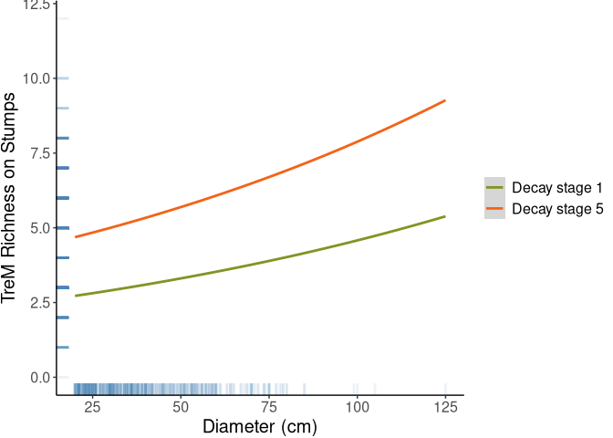

<!-- README.md is generated from README.Rmd. Please edit that file -->

# jovanovic2025

<!-- badges: start -->

[](https://lifecycle.r-lib.org/articles/stages.html#experimental)
[](https://CRAN.R-project.org/package=jovanovic2025)
[](https://github.com/pandionlabs/jovanovic2025/actions/workflows/R-CMD-check.yaml)
<!-- badges: end -->

This is the companion code and data to *Identifying and Predicting Tree
Related Microhabitats on Downed Deadwood and Stumps* a thesis by
Magdalena Jovanović submitted October 2024.

## Installation

You can install the development version of jovanovic2025 from
[GitHub](https://github.com/) with:

``` r
# install.packages("pak")
pak::pak("pandionlabs/jovanovic2025")
```

## Example

Load the package like this:

``` r
library(jovanovic2025)
```

Import the data used for these analyses with `MasterThesisData2024`.
`MasterThesisData2024` gives easy access to the table stored in
`data-raw/MasterThesisData2024.csv`.

`clean_data()` organizes `MasterThesisData2024` to be ready for
analysis. An important step is to aggregate columns into microhabitat
categories.

``` r
TreMs <- clean_data(MasterThesisData2024) 
```

If you would prefer to substitute your own data, import it with the
following

``` r
# Import the data from a comma delimited ascii file.
# TreMs <- read.table(
#   file = "put/a/path/to/your/data/here.csv",
#   header = TRUE,
#   sep = ",",
#   na.strings = "NA",
#   stringsAsFactors = TRUE,
#   dec = "."
# ) |> 
# clean_data()
```

## Summary tables

`summarize_identities` produces tables that look at the variation in the
data by species and type.

``` r

TreeIdentitiesSummary <- summarize_identities(
  TreMs, 
  grouping_variable = TreeIdentities2
  )

# If you wish to save the table, use write.table
# write.table(TreeIdentitiesSummary, file = "data/derivatives/TreeIdentitiesSummary.csv", sep = ",", quote = FALSE, row.names = FALSE)


DeadwoodIdentitiesGroupedSummary <- summarize_identities(
  TreMs, 
  grouping_variable = DeadwoodIdentitiesGrouped
  )

# If you wish to save the table, use write.table
# write.table(DeadwoodIdentitiesGroupedSummary, file = "data/derivatives/DeadwoodIdentitiesGroupedSummary.csv", sep = ",", quote = FALSE, row.names = FALSE)
```

| TreeIdentities2 | Freq | Percentage | Treedata.DBH_cm.mean | Treedata.DBH_cm.sd | Treedata.DBH_cm.min | Treedata.DBH_cm.max | Abundance.mean | Abundance.sd | Abundance.max | Richness.mean | Richness.sd | Richness.max |
|:---|---:|---:|---:|---:|---:|---:|---:|---:|---:|---:|---:|---:|
| Broadleaf Log/Entire Tree | 7 | 1.3133208 | 32.92857 | 10.320968 | 23.4 | 49.8 | 4.571429 | 3.5050983 | 12 | 3.571429 | 1.5118579 | 6 |
| Broadleaf Stump | 2 | 0.3752345 | 46.15000 | 11.525840 | 38.0 | 54.3 | 7.500000 | 0.7071068 | 8 | 6.500000 | 0.7071068 | 7 |
| Conifer Log/Entire Tree | 313 | 58.7242026 | 32.56550 | 10.787167 | 20.0 | 73.5 | 7.453674 | 7.2817779 | 86 | 4.578275 | 1.8983227 | 12 |
| Conifer Stump | 194 | 36.3977486 | 49.50670 | 17.510500 | 21.0 | 125.0 | 6.634021 | 3.3739443 | 22 | 4.917526 | 1.7074667 | 10 |
| No ID Log/Entire Tree | 5 | 0.9380863 | 27.36000 | 7.867846 | 20.3 | 39.0 | 4.600000 | 1.3416408 | 6 | 3.800000 | 1.3038405 | 6 |
| No ID Stump | 12 | 2.2514071 | 50.69167 | 18.746416 | 34.8 | 105.0 | 5.500000 | 1.5666989 | 9 | 4.500000 | 1.0871146 | 6 |

| DeadwoodIdentitiesGrouped | Freq | Percentage | Treedata.DBH_cm.mean | Treedata.DBH_cm.sd | Treedata.DBH_cm.min | Treedata.DBH_cm.max | Abundance.mean | Abundance.sd | Abundance.max | Richness.mean | Richness.sd | Richness.max |
|:---|---:|---:|---:|---:|---:|---:|---:|---:|---:|---:|---:|---:|
| A. alba Log/Entire Tree | 46 | 8.6303940 | 35.34565 | 10.404715 | 20.9 | 59.7 | 8.043478 | 5.8687743 | 31 | 4.826087 | 1.8415494 | 8 |
| A. alba Stump | 12 | 2.2514071 | 49.09167 | 12.577719 | 34.0 | 75.0 | 5.666667 | 3.0251471 | 11 | 4.666667 | 2.0150946 | 9 |
| Broadleaf Log/Entire Tree | 7 | 1.3133208 | 32.92857 | 10.320968 | 23.4 | 49.8 | 4.571429 | 3.5050983 | 12 | 3.571429 | 1.5118579 | 6 |
| Broadleaf Stump | 2 | 0.3752345 | 46.15000 | 11.525840 | 38.0 | 54.3 | 7.500000 | 0.7071068 | 8 | 6.500000 | 0.7071068 | 7 |
| Conifer Log/Entire Tree | 26 | 4.8780488 | 32.29615 | 14.722948 | 20.0 | 70.0 | 5.923077 | 4.0784612 | 17 | 4.269231 | 1.5114944 | 8 |
| Conifer Stump | 36 | 6.7542214 | 47.50000 | 16.227543 | 24.0 | 80.0 | 5.944444 | 2.6826900 | 15 | 4.916667 | 1.3174651 | 7 |
| F. sylvatica Log/Entire Tree | 49 | 9.1932458 | 32.52041 | 10.319722 | 20.0 | 57.5 | 9.367347 | 13.3474309 | 86 | 4.795918 | 1.8025398 | 10 |
| F. sylvatica Stump | 37 | 6.9418386 | 48.18649 | 14.401006 | 21.0 | 79.0 | 7.513514 | 3.1852230 | 16 | 5.594595 | 1.4806053 | 8 |
| No ID Log/Entire Tree | 5 | 0.9380863 | 27.36000 | 7.867846 | 20.3 | 39.0 | 4.600000 | 1.3416408 | 6 | 3.800000 | 1.3038405 | 6 |
| No ID Stump | 12 | 2.2514071 | 50.69167 | 18.746416 | 34.8 | 105.0 | 5.500000 | 1.5666989 | 9 | 4.500000 | 1.0871146 | 6 |
| P. abies Log/Entire Tree | 192 | 36.0225141 | 31.94740 | 10.352878 | 20.0 | 73.5 | 7.031250 | 5.4800029 | 36 | 4.505208 | 1.9815838 | 12 |
| P. abies Stump | 109 | 20.4502814 | 50.66330 | 19.340280 | 22.5 | 125.0 | 6.669725 | 3.6287306 | 22 | 4.715596 | 1.8160383 | 10 |

## Make a count table by decay stage

``` r
count_table <- make_count_table_by_decay(
  TreMs, 
  # save_name = "data/derivatives/Count_Table_by_Decay_Stage.csv"
)
```

``` r
knitr::kable(count_table)
```

| TreeIdentities2           | Decay_Stage   | Count |
|:--------------------------|:--------------|------:|
| Broadleaf Log/Entire Tree | Decay stage 1 |     2 |
| Broadleaf Stump           | Decay stage 1 |     0 |
| Conifer Log/Entire Tree   | Decay stage 1 |    11 |
| Conifer Stump             | Decay stage 1 |    12 |
| No ID Log/Entire Tree     | Decay stage 1 |     0 |
| No ID Stump               | Decay stage 1 |     0 |
| Broadleaf Log/Entire Tree | Decay stage 2 |     1 |
| Broadleaf Stump           | Decay stage 2 |     0 |
| Conifer Log/Entire Tree   | Decay stage 2 |    95 |
| Conifer Stump             | Decay stage 2 |    32 |
| No ID Log/Entire Tree     | Decay stage 2 |     0 |
| No ID Stump               | Decay stage 2 |     0 |
| Broadleaf Log/Entire Tree | Decay stage 3 |     1 |
| Broadleaf Stump           | Decay stage 3 |     0 |
| Conifer Log/Entire Tree   | Decay stage 3 |   114 |
| Conifer Stump             | Decay stage 3 |    40 |
| No ID Log/Entire Tree     | Decay stage 3 |     2 |
| No ID Stump               | Decay stage 3 |     0 |
| Broadleaf Log/Entire Tree | Decay stage 4 |     2 |
| Broadleaf Stump           | Decay stage 4 |     2 |
| Conifer Log/Entire Tree   | Decay stage 4 |    54 |
| Conifer Stump             | Decay stage 4 |    48 |
| No ID Log/Entire Tree     | Decay stage 4 |     2 |
| No ID Stump               | Decay stage 4 |     3 |
| Broadleaf Log/Entire Tree | Decay stage 5 |     1 |
| Broadleaf Stump           | Decay stage 5 |     0 |
| Conifer Log/Entire Tree   | Decay stage 5 |    39 |
| Conifer Stump             | Decay stage 5 |    62 |
| No ID Log/Entire Tree     | Decay stage 5 |     1 |
| No ID Stump               | Decay stage 5 |     9 |

## Create models

In the create models section, we build a series of models associating
various predictor (y) variables with three variables:
`GroupedTreeSpecies, Treedata.DBH_cm, and Treedata.Tree_Decay`. The
modelling family for each model is either poisson or glmmTMB::nbinom2.

The `get_model_cols()` function creates a tibble that specifies each
predictor variable and the model family used in each model

``` r
model_parameters <- get_model_cols()
```

| variable | model_family | model_formula |
|:---|:---|:---|
| DecomposedCrack | poisson | DecomposedCrack ~ GroupedTreeSpecies + Treedata.DBH_cm + Treedata.Tree_Decay + (1&#124;Plot) |
| WoodpeckerCavities | poisson | WoodpeckerCavities ~ GroupedTreeSpecies + Treedata.DBH_cm + Treedata.Tree_Decay + (1&#124;Plot) |
| Concavities | poisson | Concavities ~ GroupedTreeSpecies + Treedata.DBH_cm + Treedata.Tree_Decay + (1&#124;Plot) |
| WoodpeckerConcavities | poisson | WoodpeckerConcavities ~ GroupedTreeSpecies + Treedata.DBH_cm + Treedata.Tree_Decay + (1&#124;Plot) |
| Rotholes | poisson | Rotholes ~ GroupedTreeSpecies + Treedata.DBH_cm + Treedata.Tree_Decay + (1&#124;Plot) |
| InsectGalleries | poisson | InsectGalleries ~ GroupedTreeSpecies + Treedata.DBH_cm + Treedata.Tree_Decay + (1&#124;Plot) |
| ExposedSapwood | poisson | ExposedSapwood ~ GroupedTreeSpecies + Treedata.DBH_cm + Treedata.Tree_Decay + (1&#124;Plot) |
| ExposedHeartwood | poisson | ExposedHeartwood ~ GroupedTreeSpecies + Treedata.DBH_cm + Treedata.Tree_Decay + (1&#124;Plot) |
| ExposedSapwoodHeartwood | poisson | ExposedSapwoodHeartwood ~ GroupedTreeSpecies + Treedata.DBH_cm + Treedata.Tree_Decay + (1&#124;Plot) |
| PerennialFungi | poisson | PerennialFungi ~ GroupedTreeSpecies + Treedata.DBH_cm + Treedata.Tree_Decay + (1&#124;Plot) |
| Ephermalfungi | poisson | Ephermalfungi ~ GroupedTreeSpecies + Treedata.DBH_cm + Treedata.Tree_Decay + (1&#124;Plot) |
| EphrmalPerennialFungi | poisson | EphrmalPerennialFungi ~ GroupedTreeSpecies + Treedata.DBH_cm + Treedata.Tree_Decay + (1&#124;Plot) |
| Epiphytes | poisson | Epiphytes ~ GroupedTreeSpecies + Treedata.DBH_cm + Treedata.Tree_Decay + (1&#124;Plot) |
| DeadwooodShelter | poisson | DeadwooodShelter ~ GroupedTreeSpecies + Treedata.DBH_cm + Treedata.Tree_Decay + (1&#124;Plot) |
| StumpStructures | poisson | StumpStructures ~ GroupedTreeSpecies + Treedata.DBH_cm + Treedata.Tree_Decay + (1&#124;Plot) |
| DeadwooodShelterStumpStructures | poisson | DeadwooodShelterStumpStructures ~ GroupedTreeSpecies + Treedata.DBH_cm + Treedata.Tree_Decay + (1&#124;Plot) |
| LogStructures | poisson | LogStructures ~ GroupedTreeSpecies + Treedata.DBH_cm + Treedata.Tree_Decay + (1&#124;Plot) |
| WoodyDebris | poisson | WoodyDebris ~ GroupedTreeSpecies + Treedata.DBH_cm + Treedata.Tree_Decay + (1&#124;Plot) |
| ExposedRoots | poisson | ExposedRoots ~ GroupedTreeSpecies + Treedata.DBH_cm + Treedata.Tree_Decay + (1&#124;Plot) |
| Abundance | poisson | Abundance ~ GroupedTreeSpecies + Treedata.DBH_cm + Treedata.Tree_Decay + (1&#124;Plot) |
| Richness | poisson | Richness ~ GroupedTreeSpecies + Treedata.DBH_cm + Treedata.Tree_Decay + (1&#124;Plot) |
| DecomposedCrack | glmmTMB::nbinom2 | DecomposedCrack ~ GroupedTreeSpecies + Treedata.DBH_cm + Treedata.Tree_Decay + (1&#124;Plot) |
| WoodpeckerCavities | glmmTMB::nbinom2 | WoodpeckerCavities ~ GroupedTreeSpecies + Treedata.DBH_cm + Treedata.Tree_Decay + (1&#124;Plot) |
| Concavities | glmmTMB::nbinom2 | Concavities ~ GroupedTreeSpecies + Treedata.DBH_cm + Treedata.Tree_Decay + (1&#124;Plot) |
| WoodpeckerConcavities | glmmTMB::nbinom2 | WoodpeckerConcavities ~ GroupedTreeSpecies + Treedata.DBH_cm + Treedata.Tree_Decay + (1&#124;Plot) |
| Rotholes | glmmTMB::nbinom2 | Rotholes ~ GroupedTreeSpecies + Treedata.DBH_cm + Treedata.Tree_Decay + (1&#124;Plot) |
| InsectGalleries | glmmTMB::nbinom2 | InsectGalleries ~ GroupedTreeSpecies + Treedata.DBH_cm + Treedata.Tree_Decay + (1&#124;Plot) |
| ExposedSapwood | glmmTMB::nbinom2 | ExposedSapwood ~ GroupedTreeSpecies + Treedata.DBH_cm + Treedata.Tree_Decay + (1&#124;Plot) |
| ExposedHeartwood | glmmTMB::nbinom2 | ExposedHeartwood ~ GroupedTreeSpecies + Treedata.DBH_cm + Treedata.Tree_Decay + (1&#124;Plot) |
| ExposedSapwoodHeartwood | glmmTMB::nbinom2 | ExposedSapwoodHeartwood ~ GroupedTreeSpecies + Treedata.DBH_cm + Treedata.Tree_Decay + (1&#124;Plot) |
| PerennialFungi | glmmTMB::nbinom2 | PerennialFungi ~ GroupedTreeSpecies + Treedata.DBH_cm + Treedata.Tree_Decay + (1&#124;Plot) |
| Ephermalfungi | glmmTMB::nbinom2 | Ephermalfungi ~ GroupedTreeSpecies + Treedata.DBH_cm + Treedata.Tree_Decay + (1&#124;Plot) |
| EphrmalPerennialFungi | glmmTMB::nbinom2 | EphrmalPerennialFungi ~ GroupedTreeSpecies + Treedata.DBH_cm + Treedata.Tree_Decay + (1&#124;Plot) |
| Epiphytes | glmmTMB::nbinom2 | Epiphytes ~ GroupedTreeSpecies + Treedata.DBH_cm + Treedata.Tree_Decay + (1&#124;Plot) |
| DeadwooodShelter | glmmTMB::nbinom2 | DeadwooodShelter ~ GroupedTreeSpecies + Treedata.DBH_cm + Treedata.Tree_Decay + (1&#124;Plot) |
| StumpStructures | glmmTMB::nbinom2 | StumpStructures ~ GroupedTreeSpecies + Treedata.DBH_cm + Treedata.Tree_Decay + (1&#124;Plot) |
| DeadwooodShelterStumpStructures | glmmTMB::nbinom2 | DeadwooodShelterStumpStructures ~ GroupedTreeSpecies + Treedata.DBH_cm + Treedata.Tree_Decay + (1&#124;Plot) |
| LogStructures | glmmTMB::nbinom2 | LogStructures ~ GroupedTreeSpecies + Treedata.DBH_cm + Treedata.Tree_Decay + (1&#124;Plot) |
| WoodyDebris | glmmTMB::nbinom2 | WoodyDebris ~ GroupedTreeSpecies + Treedata.DBH_cm + Treedata.Tree_Decay + (1&#124;Plot) |
| ExposedRoots | glmmTMB::nbinom2 | ExposedRoots ~ GroupedTreeSpecies + Treedata.DBH_cm + Treedata.Tree_Decay + (1&#124;Plot) |
| Abundance | glmmTMB::nbinom2 | Abundance ~ GroupedTreeSpecies + Treedata.DBH_cm + Treedata.Tree_Decay + (1&#124;Plot) |
| Richness | glmmTMB::nbinom2 | Richness ~ GroupedTreeSpecies + Treedata.DBH_cm + Treedata.Tree_Decay + (1&#124;Plot) |

The models can be produced with `create_models()` which will create each
of the models specified in `get_model_cols()` and then save the model
summary, residuals, and results from three tests of outliers,
dispersion, and zero inflation. All these model results are returned as
a dataframe.

``` r
mod_df <- create_models(TreMs)
```

Access results of those models with the following where model_index is
the row number of the model you wish to inspect.

``` r
get_formula(mod_df, model_index = 1)
#> 
#> ── Formula ─────────────────────────────────────────────────────────────────────
#> glmmTMB::glmmTMB(formula = DecomposedCrack ~ GroupedTreeSpecies +
#> Treedata.DBH_cm + Treedata.Tree_Decay + (1 | Plot), data = TreMs, family =
#> model_family, ziformula = ~0, dispformula = ~1)
get_residuals(mod_df, model_index = 1)
#> 
#> ── Model residuals ─────────────────────────────────────────────────────────────
#> Object of Class DHARMa with simulated residuals based on 250 simulations with refit = FALSE . See ?DHARMa::simulateResiduals for help. 
#>  
#> Scaled residual values: 0.9390666 0.8147907 0.8719091 0.08886054 0.7079871 0.9811869 0.01226094 0.8598661 0.1109746 0.9110544 0.5304764 0.3844352 0.7634829 0.4438318 0.1093142 0.5528625 0.2022903 0.2578379 0.1234604 0.6637486 ...
get_test_outliers(mod_df, model_index = 1)
#> 
#> ── Model outliers ──────────────────────────────────────────────────────────────
#> [[1]]
#> 
#>  DHARMa outlier test based on exact binomial test with approximate
#>  expectations
#> 
#> data:  purrr::pluck(mod_residuals, 1)
#> outliers at both margin(s) = 1, observations = 516, p-value = 0.2047
#> alternative hypothesis: true probability of success is not equal to 0.007968127
#> 95 percent confidence interval:
#>  4.906432e-05 1.075005e-02
#> sample estimates:
#> frequency of outliers (expected: 0.00796812749003984 ) 
#>                                            0.001937984
get_test_dispersion(mod_df, model_index = 1)
#> 
#> ── Model dispersion ────────────────────────────────────────────────────────────
#> [[1]]
#> 
#>  DHARMa nonparametric dispersion test via sd of residuals fitted vs.
#>  simulated
#> 
#> data:  simulationOutput
#> dispersion = 0.82723, p-value = 0.864
#> alternative hypothesis: two.sided
get_test_zero_inflation(mod_df, model_index = 1)
#> 
#> ── Model zero inflation ────────────────────────────────────────────────────────
#> [[1]]
#> 
#>  DHARMa zero-inflation test via comparison to expected zeros with
#>  simulation under H0 = fitted model
#> 
#> data:  simulationOutput
#> ratioObsSim = 0.99962, p-value = 1
#> alternative hypothesis: two.sided
```

## Get models

We can delve into the model dataframe (`mod_df`) with `get_model_object`

``` r
# Get a model object by index
get_model_object(mod_df, 2)
#> Formula:          
#> WoodpeckerCavities ~ GroupedTreeSpecies + Treedata.DBH_cm + Treedata.Tree_Decay +  
#>     (1 | Plot)
#> Data: TreMs
#>       AIC       BIC    logLik -2*log(L)  df.resid 
#>  80.23619 114.20505 -32.11810  64.23619       508 
#> Random-effects (co)variances:
#> 
#> Conditional model:
#>  Groups Name        Std.Dev.
#>  Plot   (Intercept) 0.7388  
#> 
#> Number of obs: 516 / Conditional model: Plot, 23
#> 
#> Fixed Effects:
#> 
#> Conditional model:
#>                       (Intercept)  GroupedTreeSpeciesConiferous spp.  
#>                         -21.73522                           20.26271  
#>                   Treedata.DBH_cm   Treedata.Tree_DecayDecay stage 2  
#>                          -0.03006                           -2.39513  
#>  Treedata.Tree_DecayDecay stage 3   Treedata.Tree_DecayDecay stage 4  
#>                          -1.35112                           -2.06083  
#>  Treedata.Tree_DecayDecay stage 5  
#>                         -26.27206

# Or get a model object using filter 

mod_df |> 
  dplyr::filter(
    variable == "Rotholes",
    model_family == "poisson"
    ) |> 
  get_model_object()
#> Formula:          
#> Rotholes ~ GroupedTreeSpecies + Treedata.DBH_cm + Treedata.Tree_Decay +  
#>     (1 | Plot)
#> Data: TreMs
#>       AIC       BIC    logLik -2*log(L)  df.resid 
#>  469.8742  503.8431 -226.9371  453.8742       508 
#> Random-effects (co)variances:
#> 
#> Conditional model:
#>  Groups Name        Std.Dev.
#>  Plot   (Intercept) 0.7648  
#> 
#> Number of obs: 516 / Conditional model: Plot, 23
#> 
#> Fixed Effects:
#> 
#> Conditional model:
#>                       (Intercept)  GroupedTreeSpeciesConiferous spp.  
#>                          -0.28891                           -0.72677  
#>                   Treedata.DBH_cm   Treedata.Tree_DecayDecay stage 2  
#>                          -0.01155                           -0.85454  
#>  Treedata.Tree_DecayDecay stage 3   Treedata.Tree_DecayDecay stage 4  
#>                          -0.44195                           -0.97527  
#>  Treedata.Tree_DecayDecay stage 5  
#>                          -1.32795
```

## Make a graph

Use ggeffects to predict on a model and then graph it with ggplot.

``` r
Predicted_RichnessStump <- 
mod_df |> 
  dplyr::filter(
    variable == "Richness",
    model_family == "nbinom2"
    ) |> 
  get_model_object() |> 
  ggeffects::ggpredict(
    terms = c("Treedata.DBH_cm", "Treedata.Tree_Decay[Decay stage 1, Decay stage 5]")
  )
#> You are calculating adjusted predictions on the population-level (i.e.
#>   `type = "fixed"`) for a *generalized* linear mixed model.
#>   This may produce biased estimates due to Jensen's inequality. Consider
#>   setting `bias_correction = TRUE` to correct for this bias.
#>   See also the documentation of the `bias_correction` argument.

library(ggplot2)
ggplot() +
  geom_smooth(
    data = Predicted_RichnessStump, 
    mapping = aes(x = x, y = predicted, colour = group)
    ) +
  geom_rug(
    data = TreMs, 
    mapping = aes(x = Treedata.DBH_cm, y = Richness), 
    col = "steelblue",
    alpha=0.1, 
    size=1
    ) +
  xlab("Diameter (cm)") + ylab("TreM Richness on Stumps") + 
  scale_x_continuous(n.breaks = 5) +
  theme_bw() +
  theme(
    text = element_text(size=15), 
    legend.title = element_blank(),
    plot.margin = margin(0.5, 2, 0.5, 0.5),
    panel.border = element_blank(), 
    panel.grid.major = element_blank(),
    panel.grid.minor = element_blank(), 
    axis.line = element_line(colour = "black")
    ) +
  scale_linetype(guide = "none") +
  scale_color_manual(values = c("Decay stage 1" = "#849324", "Decay stage 5" = "#f26419")) +
  scale_fill_manual(values = c("Decay stage 1" = "#849324", "Decay stage 5" = "#f26419"))
#> Warning: Using `size` aesthetic for lines was deprecated in ggplot2 3.4.0.
#> ℹ Please use `linewidth` instead.
#> This warning is displayed once every 8 hours.
#> Call `lifecycle::last_lifecycle_warnings()` to see where this warning was
#> generated.
#> `geom_smooth()` using method = 'loess' and formula = 'y ~ x'
#> Warning: No shared levels found between `names(values)` of the manual scale and the
#> data's fill values.
```



## Explore results

check those pages for raw output from [all the
models](https://pandionlabs.github.io/jovanovic2025/articles/all_models.html)
and [all the
plots](https://pandionlabs.github.io/jovanovic2025/articles/all_plots.html).
