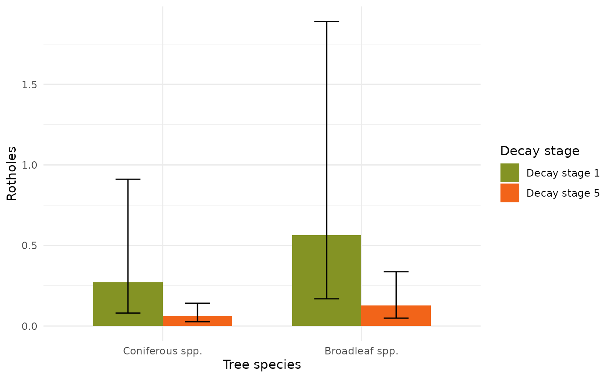
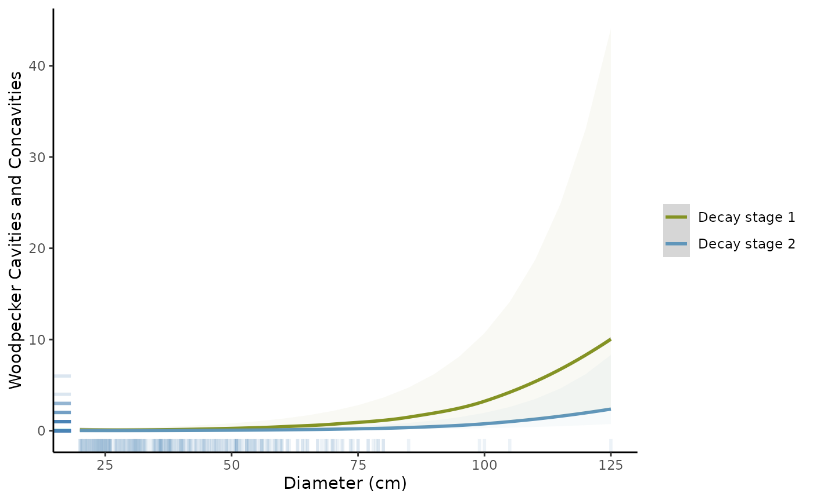
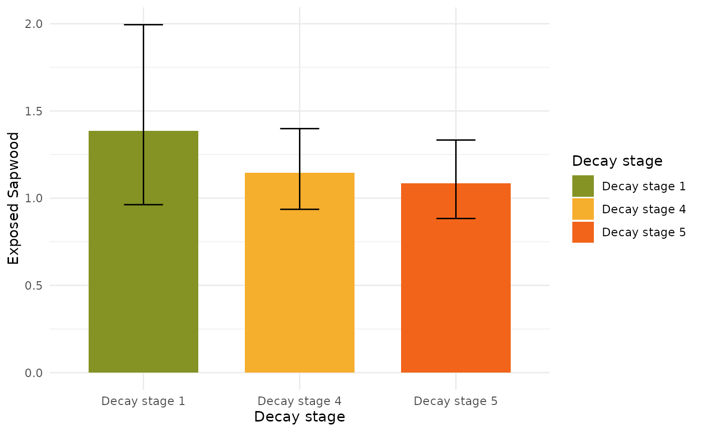
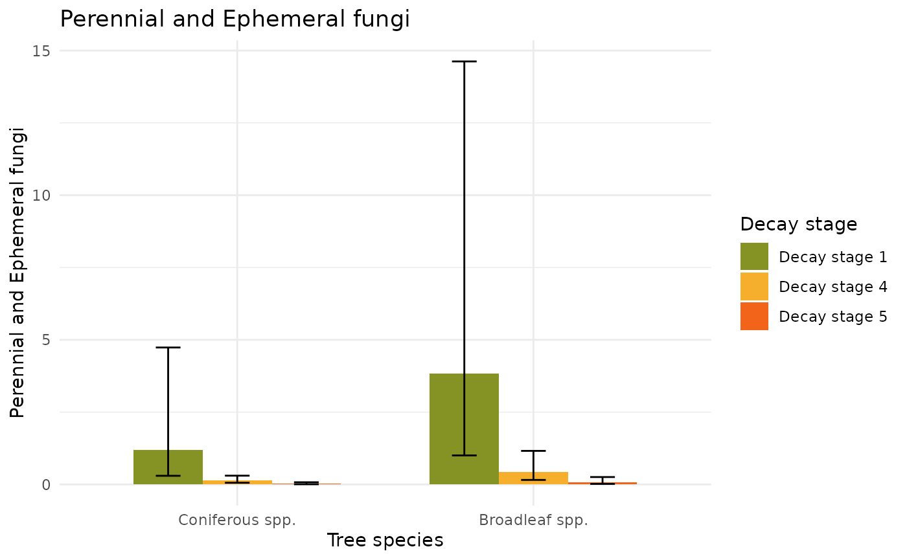
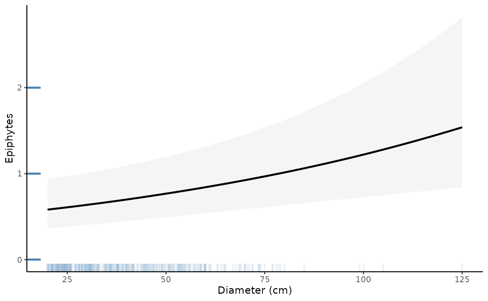
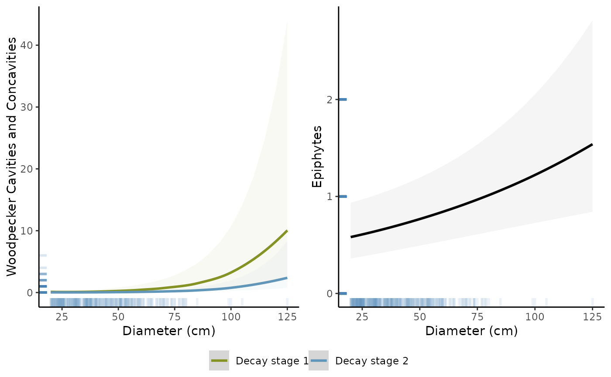
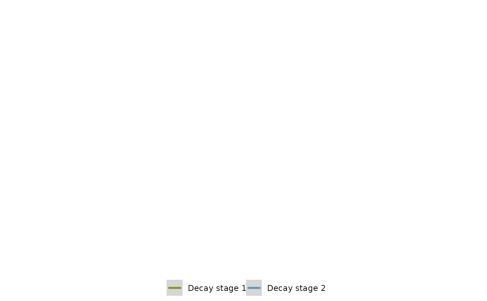
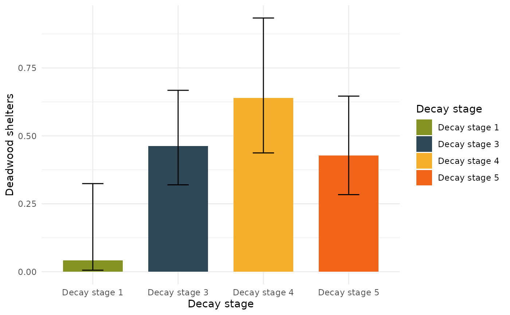
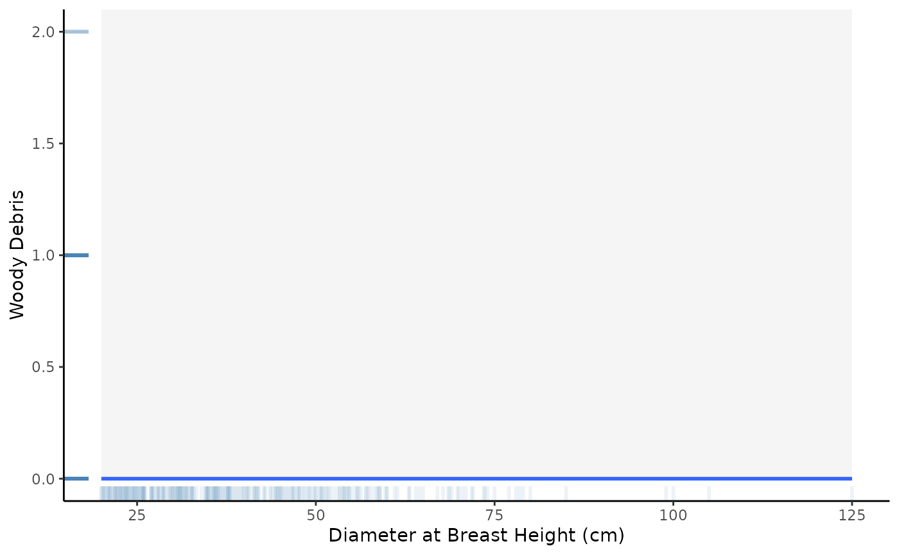

# All plots

``` r
library(jovanovic2025)
library(ggplot2)
library(ggeffects)
library(purrr)
TreMs <- clean_data(MasterThesisData2024)
mod_df <- create_models(TreMs)
```

``` r
(plotROTHOLES <-
  mod_df |>
  dplyr::filter(
    variable == "Rotholes",
    model_family == "nbinom2"
  ) |>
  get_model_object() |>
  ggpredict(
    terms = c(
      "GroupedTreeSpecies[Coniferous spp., Broadleaf spp.]",
      "Treedata.Tree_Decay[Decay stage 1,Decay stage 5]"
    ),
  ) |>
  ggplot(aes(x = x, y = predicted, fill = group)) +
  geom_col(position = "dodge", width = 0.7) + # Columns for predicted values
  geom_errorbar(
    aes(ymin = conf.low, ymax = conf.high),
    position = position_dodge(0.7),
    width = 0.25
  ) + # Error bars based on confidence intervals
  labs(
    x = "Tree species",
    y = "Rotholes",
    fill = "Decay stage"
  ) +
  scale_fill_manual(
    values = c("Decay stage 1" = "#849324", "Decay stage 5" = "#f26419")
  ) +
  theme_minimal())
You are calculating adjusted predictions on the population-level (i.e.
  `type = "fixed"`) for a *generalized* linear mixed model.
  This may produce biased estimates due to Jensen's inequality. Consider
  setting `bias_correction = TRUE` to correct for this bias.
  See also the documentation of the `bias_correction` argument.
Some of the focal terms are of type `character`. This may lead to
  unexpected results. It is recommended to convert these variables to
  factors before fitting the model.
  The following variables are of type character: `GroupedTreeSpecies`
```



``` r
(plotCONCAV <-
  mod_df |>
  dplyr::filter(
    variable == "WoodpeckerConcavities",
    model_family == "nbinom2"
  ) |>
  get_model_object() |>
  ggpredict(
    terms = c(
      "Treedata.DBH_cm",
      "Treedata.Tree_Decay[Decay stage 1, Decay stage 2]"
    )
  ) |>
  ggplot() +
  geom_smooth(mapping = aes(x = x, y = predicted, colour = group)) +
  geom_ribbon(
    mapping = aes(
      x = x,
      y = predicted,
      ymin = conf.low,
      ymax = conf.high,
      fill = group,
      colour = NULL
    ),
    alpha = .05,
    show.legend = FALSE
  ) +

  geom_rug(
    data = TreMs,
    mapping = aes(x = Treedata.DBH_cm, y = WoodpeckerConcavities),
    col = "steelblue",
    alpha = 0.1,
    linewidth = 1
  ) +
  xlab("Diameter (cm)") +
  ylab("Woodpecker Cavities and Concavities") +
  scale_x_continuous(n.breaks = 5) +
  theme(
    text = element_text(size = 8),
    legend.title = element_blank(),
    plot.margin = margin(0.5, 2, 0.5, 0.5)
  ) +
  scale_linetype(guide = "none") +
  theme_bw() +
  theme(
    panel.border = element_blank(),
    panel.grid.major = element_blank(),
    panel.grid.minor = element_blank(),
    axis.line = element_line(colour = "black")
  ) +
  scale_color_manual(
    values = c("Decay stage 1" = "#849324", "Decay stage 2" = "#6096ba")
  ) +
  scale_fill_manual(
    values = c("Decay stage 1" = "#849324", "Decay stage 2" = "#6096ba")
  ) +
  theme(legend.title = element_blank()))

[1m
[22m`geom_smooth()` using method = 'loess' and formula = 'y ~ x'
```



``` r
(plotSAPWOOD <-
  mod_df |>
  dplyr::filter(
    variable == "ExposedSapwood",
    model_family == "nbinom2"
  ) |>
  get_model_object() |> 
  ggpredict(
    terms = c("Treedata.Tree_Decay[Decay stage 1,Decay stage 4, Decay stage 5]")
  ) |>
  ggplot(aes(x = x, y = predicted, fill = x)) +
  geom_col(position = "dodge", width = 0.7) +
  geom_errorbar(aes(ymin = conf.low, ymax = conf.high), 
                position = position_dodge(0.7), 
                width = 0.25) +
  labs(x = "Decay stage",
       y = "Exposed Sapwood",
       fill = "Decay stage") +
  scale_fill_manual(values = c("Decay stage 1" = "#849324",
                               "Decay stage 4" = "#f6ae2d",
                               "Decay stage 5" = "#f26419")) +
  theme_minimal())
```



``` r
(plot_allfungi <-
  mod_df |>
  dplyr::filter(
    variable == "EphrmalPerennialFungi",
    model_family == "nbinom2"
  ) |>
  get_model_object() |>
  ggpredict(
    terms = c(
      "GroupedTreeSpecies[Coniferous spp., Broadleaf spp.]",
      "Treedata.Tree_Decay[Decay stage 1,Decay stage 4, Decay stage 5]"
    ),
  ) |>
  ggplot(aes(x = x, y = predicted, fill = group)) +
  geom_col(position = "dodge", width = 0.7) + # Columns for predicted values
  geom_errorbar(
    aes(ymin = conf.low, ymax = conf.high),
    position = position_dodge(0.7),
    width = 0.25
  ) + # Error bars based on confidence intervals
  labs(
    title = "Perennial and Ephemeral fungi",
    x = "Tree species",
    y = "Perennial and Ephemeral fungi",
    fill = "Decay stage"
  ) +
  scale_fill_manual(
    values = c(
      "Decay stage 1" = "#849324",
      "Decay stage 4" = "#f6ae2d",
      "Decay stage 5" = "#f26419"
    )
  ) +
  theme_minimal())
Some of the focal terms are of type `character`. This may lead to
  unexpected results. It is recommended to convert these variables to
  factors before fitting the model.
  The following variables are of type character: `GroupedTreeSpecies`
```



``` r
(plot_epiphytes <-
  mod_df |>
  dplyr::filter(
    variable == "Epiphytes",
    model_family == "nbinom2"
  ) |>
  get_model_object() |>
  ggpredict(
    terms = c("Treedata.DBH_cm")
  ) |>
  ggplot() +
  geom_smooth(aes(x = x, y = predicted), colour = "black") + # Set the line color to black
  geom_ribbon(
    aes(x = x, y = predicted, ymin = conf.low, ymax = conf.high, colour = NULL),
    alpha = .05,
    show.legend = FALSE
  ) +
  geom_rug(
    data = TreMs,
    mapping = aes(x = Treedata.DBH_cm, y = Epiphytes),
    col = "steelblue",
    alpha = 0.1,
    size = 1
  ) +
  xlab("Diameter (cm)") +
  ylab("Epiphytes") +
  scale_x_continuous(n.breaks = 5) +
  theme(
    text = element_text(size = 8),
    legend.title = element_blank(),
    plot.margin = margin(0.5, 2, 0.5, 0.5)
  ) +
  scale_linetype(guide = "none") +
  theme_bw() +
  theme(
    panel.border = element_blank(),
    panel.grid.major = element_blank(),
    panel.grid.minor = element_blank(),
    axis.line = element_line(colour = "black")
  ) +
  scale_color_viridis_d() +
  scale_fill_viridis_d() +
  theme(legend.title = element_blank()))
Warning: 
[1m
[22mUsing `size` aesthetic for lines was deprecated in ggplot2 3.4.0.

[36mℹ
[39m Please use `linewidth` instead.

[90mThis warning is displayed once per session.
[39m

[90mCall `lifecycle::last_lifecycle_warnings()` to see where this warning was
[39m

[90mgenerated.
[39m

[1m
[22m`geom_smooth()` using method = 'loess' and formula = 'y ~ x'
```



``` r
(figTremsDBH <- ggpubr::ggarrange(
  plotCONCAV,
  plot_epiphytes,
  ncol = 2,
  nrow = 1,
  common.legend = TRUE,
  legend = "bottom",
  combine = TRUE
))

[1m
[22m`geom_smooth()` using method = 'loess' and formula = 'y ~ x'

[1m
[22m`geom_smooth()` using method = 'loess' and formula = 'y ~ x'

[1m
[22m`geom_smooth()` using method = 'loess' and formula = 'y ~ x'
$`1`
```



    $`2`



    attr(,"class")
    [1] "list"      "ggarrange"

``` r
(plot_shelters <-
  mod_df |>
  dplyr::filter(
    variable == "DeadwoodShelter",
    model_family == "nbinom2"
  ) |>
  get_model_object() |>
  ggpredict(
    terms = c(
      "Treedata.Tree_Decay[Decay stage 1,Decay stage 3, Decay stage 4, Decay stage 5]"
    )
  ) |>
  ggplot(aes(x = x, y = predicted, fill = x)) +
  geom_col(position = "dodge", width = 0.7) + # Columns for predicted values
  geom_errorbar(
    aes(ymin = conf.low, ymax = conf.high),
    position = position_dodge(0.7),
    width = 0.25
  ) + # Error bars based on confidence intervals
  labs(
    x = "Decay stage",
    y = "Deadwood shelters",
    fill = "Decay stage"
  ) +
  scale_fill_manual(
    values = c(
      "Decay stage 1" = "#849324",
      "Decay stage 3" = "#2f4858",
      "Decay stage 4" = "#f6ae2d",
      "Decay stage 5" = "#f26419"
    )
  ) +
  theme_minimal())
```



``` r
(plot_woodydebris <-
  mod_df |>
  dplyr::filter(
    variable == "WoodyDebris",
    model_family == "nbinom2"
  ) |>
  get_model_object() |>
  ggpredict(
    terms = c("Treedata.DBH_cm")
  ) |>
  ggplot() +
  geom_smooth(aes(x = x, y = predicted)) +
  geom_ribbon(
    aes(x = x, y = predicted, ymin = conf.low, ymax = conf.high, colour = NULL),
    alpha = .05,
    show.legend = FALSE
  ) +
  geom_rug(
    data = TreMs,
    mapping = aes(x = Treedata.DBH_cm, y = WoodyDebris),
    col = "steelblue",
    alpha = 0.1,
    size = 1
  ) +
  xlab("Diameter at Breast Height (cm)") +
  ylab("Woody Debris") +
  scale_x_continuous(n.breaks = 5) +
  theme(
    text = element_text(size = 8),
    legend.title = element_blank(),
    plot.margin = margin(0.5, 2, 0.5, 0.5)
  ) +
  scale_linetype(guide = "none") +
  theme_bw() +
  theme(
    panel.border = element_blank(),
    panel.grid.major = element_blank(),
    panel.grid.minor = element_blank(),
    axis.line = element_line(colour = "black")
  ) +
  scale_color_viridis_d() +
  scale_fill_viridis_d() +
  theme(legend.title = element_blank()))

[1m
[22m`geom_smooth()` using method = 'loess' and formula = 'y ~ x'
```


